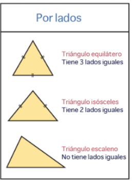

A- Escribir una clase en python llamada rectángulo que contenga una base y una altura, y que contenga un método que devuelva el área del rectángulo.

B- En un banco tienen clientes que pueden hacer depósitos y extracciones de dinero. El banco requiere también al final del día calcular la cantidad de dinero que se ha depositado.
Se deberán crear dos clases, la clase cliente y la clase banco. La clase cliente tendrá los atributos nombre y cantidad y los métodos __init__, depositar, extraer, mostrar_total.

  

----------------------------------------------------------------------------------------------

1-   Realizar un programa que conste de una clase llamada Alumno que tenga como atributos el nombre y la nota del alumno. Definir los métodos para inicializar sus atributos, imprimirlos y mostrar un mensaje con el resultado de la nota y si ha aprobado o no. ( 1 Punto )

2- Realizar un programa que tenga una clase Persona con las siguientes características. La clase tendrá como atributos el nombre y la edad de una persona. Implementar los métodos necesarios para inicializar los atributos, mostrar los datos e indicar si la persona es mayor de edad o no. ( 1 Punto )

3- Desarrollar un programa que cargue los datos de un triángulo. Implementar una clase con los métodos para inicializar los atributos, imprimir el valor del lado con un tamaño mayor y  el tipo de triángulo que es (equilátero, isósceles o escaleno). ( 1 Punto )

4- Realizar un programa en el cual se declaren dos valores enteros por teclado utilizando el método __init__. Calcular después la suma, resta, multiplicación y división. Utilizar un método para cada una e imprimir los resultados obtenidos. Llamar a la clase Calculadora. ( 1 Punto )

5- Realizar una clase que administre una agenda. Se debe almacenar para cada contacto el nombre, el teléfono y el email. Además deberá mostrar un menú con las siguientes opciones: ( 5 puntos )
Añadir contacto
Lista de contactos
Buscar contacto
Editar contacto
Cerrar agenda

6- Crear la clase Animal con los siguientes atributos: cantidad de extremidades, peso, familia y luego crear la clase Perro, esta clase debe heredar los atributos de un Animal + la edad del perro. Implementar una función en la clase Perro que retorne los datos de la mascota perruna. ( 1 punto )
